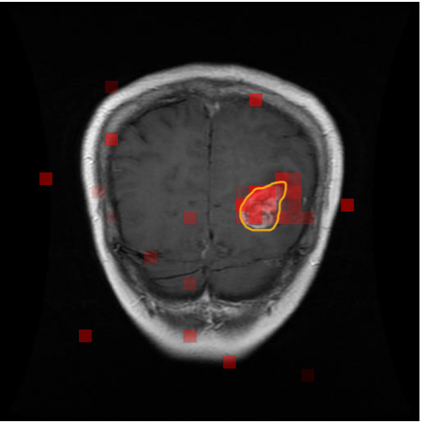

# Adaptive Routing Transformer (ART)

**Adaptive Routing Transformer (ART)** is an experimental routing-based Transformer architecture for efficient and interpretable medical image classification. Instead of applying full self-attention uniformly to all image patches, ART uses a lightweight routing mechanism to identify and process the most informative visual tokens.

The project was developed for medical imaging tasks where both predictive performance and model transparency are important. By adaptively routing computation toward visually informative regions, ART aims to reduce unnecessary computation while producing token-level importance maps that can be visualized for interpretability analysis.

> **Note:** This project is intended for research and educational purposes only. It is not a medical device and should not be used for clinical diagnosis or treatment decisions.

---

## Key Features

* Adaptive token routing for medical image classification
* Top-k patch selection to focus computation on informative image regions
* Routing-based attention visualization for qualitative interpretability analysis
* CNN-based embedding variant for extracting local visual features before Transformer processing
* PyTorch implementation with mixed-precision training support
* Distributed training support with PyTorch DDP
* Experiments on public medical imaging datasets, including chest X-ray and brain MRI classification

---

## Motivation

Vision Transformers can achieve strong performance in image classification, but applying self-attention uniformly to all image patches may be computationally expensive and inefficient, especially for high-resolution medical images. In many medical imaging tasks, only a subset of regions may contain the most diagnostically relevant visual patterns.

ART explores the idea of adaptive computation: instead of processing every token equally, the model learns to select important tokens and allocate more computation to them. This design is motivated by two goals:

1. **Efficiency**: reduce unnecessary computation on less informative image patches.
2. **Interpretability**: provide token-level routing maps that help inspect which regions contribute to the model’s prediction.

---

## Method Overview

ART converts an input medical image into a sequence of visual tokens. A lightweight routing module assigns an importance score to each token and selects the top-k most relevant tokens. These selected tokens are passed through Transformer blocks, and the updated representations are merged back into the full token sequence.

This adaptive routing mechanism allows the model to focus computation on visually informative regions while keeping the overall architecture compatible with Vision Transformer-style image classification.

At a high level, the pipeline is:

```text
Input Medical Image
        |
        v
Image / CNN Embedding
        |
        v
Visual Tokens
        |
        v
Token Router
        |
        v
Top-k Informative Tokens
        |
        v
Transformer Processing
        |
        v
Token Aggregation
        |
        v
Classification Output
```

---

## Architecture

The main components of ART are:

### 1. Image Embedding

ART supports visual tokenization using either patch-based embedding or a CNN-based embedding module. The CNN-based version first extracts local visual features before projecting them into Transformer token embeddings.

### 2. Adaptive Token Router

The router assigns an importance score to each visual token. The top-k tokens are selected for further Transformer processing.

### 3. Routing Transformer Block

Selected tokens are processed by attention and feed-forward layers. Their updated representations are then merged back into the original token sequence.

### 4. Classification Head

The final token representations are aggregated and passed through a classification head for medical image classification.

---

## Interpretability Visualization

A key motivation of ART is to make the model’s decision process more inspectable for medical images. The routing module produces token-level importance scores, which can be projected back onto the input image to visualize which regions were emphasized during prediction.


```text
assets/
├── art_architecture.png
├── glimona_tumor.png
├── Effusion.png
├── Infiltrate.png
```

Example README visualization:

<p align="center">
  
</p>

<p align="center">
  <em>Example routing-based interpretability map generated by ART.</em>
</p>

These visualizations provide qualitative insight into model behavior. They are intended for research inspection only and should not be interpreted as clinical explanations.

---

## Example Results

Add your validated results here after running controlled experiments.

| Model        |               Dataset | Accuracy |   FLops              |
| ------------ | --------------------: | -------: | ------------------- |
| ART          |       Brain Tumor MRI |      99.16 | 2.1     |
| Baseline ViT |          Same setting |      85.85 | 88.2 |

Example qualitative result table:

| Input Image                                  | ART Attention / Routing Map                      | Prediction |
| -------------------------------------------- | ------------------------------------------------ | ---------- |
| `` | `` | Pneumonia  |
| `` | `` | Normal     |

> For a fair comparison, results should be reported using the same train/test split, preprocessing pipeline, metric definition, and hardware setting.

---

## Repository Structure

```text
.
├── train.py                       # Main training script
├── main.py                        # Hydra/DDP training entry point
├── Trainer.py                     # Distributed training trainer
├── experts_model.py               # Routing Vision Transformer implementation
├── Cnn_routing_vit.py             # CNN + Routing Transformer variant
├── CNN_Routing_transformer.py      # Alternative CNN-routing implementation
├── original_model.py              # Baseline / original model implementation
├── model_top_k.py                 # Top-k routing model implementation
├── process_data.py                # Chest X-ray dataset loading
├── mri_brain_dataset.py           # Brain MRI dataset loading
├── routing_transformer_cfg.yaml   # Model and training configuration
├── configurator.py                # Lightweight configuration override script
├── requirements.txt               # Python dependencies
└── assets/                        # Architecture figures and attention visualizations
```

---

## Installation

Clone the repository:

```bash
git clone https://github.com/your-username/Adaptive-Routing-Transformer.git
cd Adaptive-Routing-Transformer
```

Create and activate a virtual environment:

```bash
python -m venv venv
source venv/bin/activate
```

Install dependencies:

```bash
pip install -r requirements.txt
```

---

## Requirements

The main dependencies include:

```text
torch
torchvision
hydra-core
einops
datasets
kagglehub
wandb
```

Depending on the model variant, you may also need:

```text
rotary-embedding-torch
```

You can install it with:

```bash
pip install rotary-embedding-torch
```

---

## Datasets

This project includes dataset loading scripts for public medical imaging datasets.

### Chest X-ray Pneumonia Dataset

The chest X-ray dataset can be downloaded through KaggleHub. The dataset is loaded using `torchvision.datasets.ImageFolder`.

Expected structure:

```text
chest_xray/
├── train/
│   ├── NORMAL/
│   └── PNEUMONIA/
├── test/
│   ├── NORMAL/
│   └── PNEUMONIA/
└── val/
    ├── NORMAL/
    └── PNEUMONIA/
```

### Brain Tumor MRI Dataset

The brain tumor MRI dataset is also loaded using `ImageFolder`.

Expected structure:

```text
brain_tumor_mri/
├── Training/
│   ├── glioma/
│   ├── meningioma/
│   ├── notumor/
│   └── pituitary/
└── Testing/
    ├── glioma/
    ├── meningioma/
    ├── notumor/
    └── pituitary/
```

> Before training, make sure the number of output classes in the model configuration matches the dataset.

---

## Training

To train the model using the main training script:

```bash
python train.py
```

For distributed training with PyTorch DDP:

```bash
torchrun --nproc_per_node=1 main.py
```

For multi-GPU training:

```bash
torchrun --nproc_per_node=4 main.py
```

You can modify model and training settings in:

```text
routing_transformer_cfg.yaml
```

Common configuration options include:

```yaml
RoutingConfig:
  image_size: 224
  n_layers: 12
  embedd_dim: 512
  n_heads: 8
  top_k: 128
  classes: 2

OptimizerConfig:
  learning_rate: 3e-4
  weight_decay: 0.1

TrainerConfig:
  max_epochs: 224
  batch_size: 32
  use_amp: true
```

---

## Inference and Visualization

To visualize routing or attention maps, save the token-level routing scores during the forward pass and project them back to the image grid.

Suggested workflow:

```text
1. Load a trained ART checkpoint.
2. Run inference on a medical image.
3. Extract routing scores or selected token indices.
4. Convert token scores into a spatial heatmap.
5. Overlay the heatmap on the original image.
6. Save the visualization to the assets/ folder.
```

Example output:

```text
assets/
├── original_xray.png
├── art_attention_xray.png
└── overlay_xray.png
```

Recommended caption:

```text
Routing-based visualization showing image regions emphasized by ART during prediction.
```

---

## Checkpoints

Model checkpoints are saved under the output directory, for example:

```text
out/snapshot.pt
```

A checkpoint typically stores:

```text
model state dict
optimizer state dict
model arguments
training epoch
best validation accuracy
configuration
```

To resume training, set:

```python
init_from = "resume"
```

or configure the corresponding option in your configuration file.

---

## Notes on Interpretability

The visualizations generated by ART should be understood as qualitative inspection tools. They can help researchers examine whether the model focuses on visually meaningful regions, but they do not provide definitive medical explanations.

In medical AI, interpretability should be evaluated carefully and, when possible, compared with expert annotations or clinically meaningful regions of interest.

---

## Limitations

* The current implementation is experimental and intended for research use.
* Results may depend heavily on dataset split, preprocessing, and training configuration.
* Routing maps provide qualitative insight but should not be treated as clinical explanations.
* Additional validation is required before considering any medical deployment.
* Public datasets may contain biases, artifacts, or limited diversity.

---

## Future Work

Potential directions for improvement include:

* Benchmarking ART against standard ViT, CNN, and efficient Transformer baselines
* Adding quantitative efficiency metrics such as FLOPs, inference latency, and memory usage
* Comparing routing maps with expert-annotated regions of interest
* Extending ART to multi-class and multi-modal medical imaging tasks
* Improving visualization tools for routing and attention maps
* Adding pretrained weights and reproducible experiment scripts

---


---

## Disclaimer

This repository is for research and educational purposes only. The models and visualizations provided here are not intended for clinical use, medical diagnosis, treatment planning, or any real-world medical decision-making.
